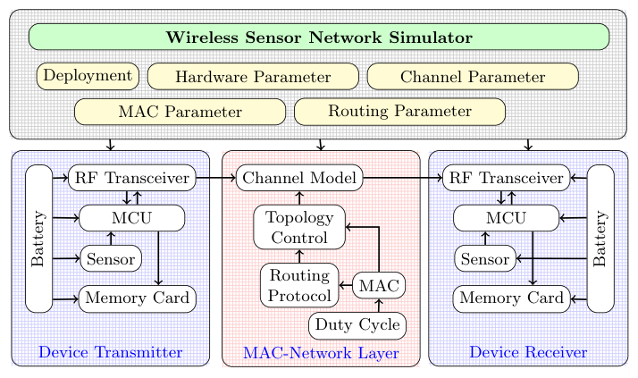

# WSN Simulator for IEEE 802.15.4 Networks  

<p align="justify">
This repository provides a discrete‑event simulation of a beaconless IEEE 802.15.4 network that uses the unslotted CSMA/CA MAC protocol.  
Multiple sensor nodes transmit data simultaneously to a central base station. The simulation explicitly models both hidden‑terminal and exposed‑terminal problems, giving insight into how these phenomena affect network performance.
</p>

---

## Table of Contents
- [WSN Simulator for IEEE 802.15.4 Networks](#wsn-simulator-for-ieee-802154-networks)
  - [Table of Contents](#table-of-contents)
  - [Overview](#overview)
  - [Simulator Architecture](#simulator-architecture)
    - [1. Channel Model](#1-channel-model)
    - [2. Collision Model](#2-collision-model)
    - [3. Energy Consumption Model](#3-energy-consumption-model)
  - [Installation](#installation)
    - [For those who want to run the gui.py:](#for-those-who-want-to-run-the-guipy)

---

## Overview
- **Protocol:** IEEE 802.15.4 (beaconless mode, unslotted CSMA/CA)  
- **Methodology:** Discrete‑Event Simulation (DES)  
- **Topology:** Multiple sensor nodes → one base station  
- **Channel access:** Nodes transmit simultaneously; collisions are resolved (or not) by the MAC and physical layer models.  
- **Special focus:** Hidden‑terminal and exposed‑terminal effects, realistic channel impairments, and per‑state energy consumption.


---

## Simulator Architecture

The overall structure of the simulator is illustrated below:

<p align="center">
  
</p>


### 1. Channel Model 
The model are documented in ([Model documentation](./channel/path_loss/documentation.md))

- **Path‑loss model** – accounts for signal attenuation over distance.
- **Fading** – small‑scale fading (e.g., Rayleigh or Rician) to capture real‑world variability.
- **Jitter** – random timing variations to avoid perfect synchronisation artefacts.

### 2. Collision Model
The model are documented in ([Model documentation](./channel/interference/documentation.md))

- **Hidden terminal** – two nodes that cannot hear each other transmit to the same receiver, causing a collision at the receiver.
- **Exposed terminal** – a node refrains from transmitting because it senses a transmission that would not actually interfere with its intended receiver.


### 3. Energy Consumption Model
The radio of each sensor node is tracked through five distinct states:
1. **Sensing** ([Model documentation](./node/documentation.md))  
2. **Logging** ([Model documentation](./node/documentation.md)) 
3. **Transmitting and Receiving** ([Model documentation](./node/rf/documentation.md)) 
5. **Sleep** ([Model documentation](./node/rf/documentation.md)) 

Energy consumption is calculated per state using configurable current/time parameters, enabling accurate lifetime estimation.

---

## Installation
The simulator requires **Python 3.12+** (tested with 3.12.3).  

### For those who want to run the gui.py:

1. Clone the repository:
   ```bash
   git clone https://github.com/yourusername/WSN-Simulator-for-IEEE-802.15.4-Network.git
   cd WSN-Simulator-for-IEEE-802.15.4-Network

2. Install the require dependencies:
    ```bash
    pip install -r requirements.txt
    ```

### For those want to run through .exe for windows:
[Open and Run this application](temp.exe)


### Citation:
[](https://doi.org/10.5281/zenodo.20603785)
```bibtex
@software{ab_dewantara_2026_20603785,
  author       = {ab\_dewantara},
  title        = {BiggusMaximus/WSN-Simulator-for-
                   IEEE-802.15.4-Network: WSN Simulator for IEEE
                   802.15.4 Beaconless Network
                  },
  month        = jun,
  year         = 2026,
  publisher    = {Zenodo},
  version      = {v1.0.0},
  doi          = {10.5281/zenodo.20603785},
  url          = {https://doi.org/10.5281/zenodo.20603785},
  swhid        = {swh:1:dir:6ca93c6e2664cc91dbb871f81b59786c16b78cb0
                   ;origin=https://doi.org/10.5281/zenodo.20603784;vi
                   sit=swh:1:snp:b37a389fba0e6963618a54e6967b134a9634
                   1a0b;anchor=swh:1:rel:3ff5d54ad8906f8e929846f7f583
                   4cb931eff51e;path=BiggusMaximus-WSN-Simulator-for-
                   IEEE-802.15.4-Network-9d15d64
                  },
}
```