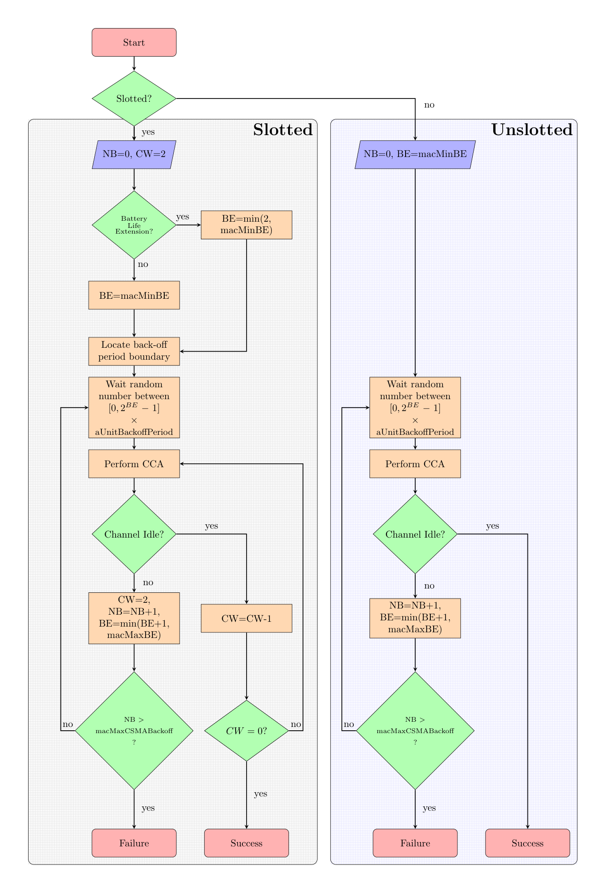

## Collision Modeling

Collision problems in the IEEE 802.15.4 protocol  are generally categorized into two main types: the hidden node and exposed node terminal, as illustrated in Figure 1 [1]. Unlike the IEEE 802.11 protocol, which provides Request to Send (RTS) and Clear to Send (CTS) handshake mechanisms to reduce collision probability, the IEEE 802.15.4 standard does not define RTS/CTS. Instead, IEEE 802.15.4 relies on a CSMA mechanism with CCA to sense the channel before transmission.

  

A hidden node scenario occurs when two nodes are outside each other’s transmission range and cannot detect each other’s signals, yet both are within range of the same destination node. In Figure 1, node A and node C can both communicate with node B, but A and C cannot detect each other. When node C transmits, the power received at node A is below the energy detection threshold, so node A perceives the channel as idle. The same applies to node C with respect to node A’s transmission. If both A and C start transmitting to B simultaneously, a collision occurs at the receiver B. In general, a collision event in the hidden node scenario can be modeled as the intersection of several conditions, denoted in equation (7). All five conditions must be satisfied simultaneously for a collision to happen at the receiver.

$$
\mathbb{I}_1 \cap \mathbb{I}_2 \cap \mathbb{I}_3 \cap \mathbb{I}_4 \cap \mathbb{I}_5 \tag{7}
$$

The first condition ($\mathbb{I}_1$) represents time overlap, i.e., the transmission intervals of two nodes overlap on the same channel. If $t_{v_i}^{start}$ and $t_{v_i}^{end}$ denote the start and end transmission times of node $v_i$, this condition is formulated in equation (8).

$$
\underbrace{\left[t_{v_i}^{start},t_{v_i}^{end}\right] 
\cap 
\left[t_{v_k}^{start},t_{v_k}^{end}\right] 
\neq \emptyset}_{\mathbb{I}_1 } \tag{8}
$$

The second condition ($\mathbb{I}_2$) ensures that neither node detects the channel as busy via CCA. This happens when the received power from the other node is below the CCA detection threshold $P_{CCA}$, as shown in equation (9).

$$
\underbrace{
\left[P_{RX} \left(v_i, v_k\right) \leq P_{CCA}\right] 
\cap 
\left[P_{RX} \left(v_k, v_i\right) \leq P_{CCA}\right]
}_{\mathbb{I}_2} \tag{9}
$$

The third condition ($\mathbb{I}_3$) states that both nodes have sufficient received power at the destination $v_j$, i.e., above the minimum receiver sensitivity. Thus, both transmissions would individually be decodable in the absence of interference, as formulated in equation (10).

$$
\underbrace{
    \left[P_{RX} \left(v_i, v_j\right) \geq P_{RX,\text{min}}^{@1\%\text{PER}}\right]
    \cap
    \left[P_{RX} \left(v_k, v_j\right) \geq P_{RX,\text{min}}^{@1\%\text{PER}}\right]
}_{\mathbb{I}_3} \tag{10}
$$

The fourth condition ($\mathbb{I}_4$) relates to the SINR at the receiver. For a collision to occur, the SINR must drop below a threshold $\mathrm{SINR}_{\text{thresh}}$ due to interference from simultaneous transmissions, as defined in equation (11). The fifth condition ($\mathbb{I}_5$) ensures that the destination node $v_j$ is not transmitting at the same time, because if $v_j$ is transmitting, it cannot receive data. This is expressed in equation (12).

$$
\underbrace{
    \frac{P_{RX} ({v_i, v_j})} {\displaystyle\sum_{v_m \in \mathcal{T}(t) \setminus  \left\{v_i\right\}} P_{RX} ({v_m, v_j}) + N_0} 
    < \mathrm{SINR}_{\text{thresh}}
}_{\mathbb{I}_4} \tag{11}
$$

$$
\underbrace{
    v_j \notin \mathcal{T}(t)
}_{\mathbb{I}_5} \tag{12}
$$

The other phenomenon, the exposed node, is also depicted in Figure 1. This occurs when a source node cannot transmit to its destination because another node within its detection range is currently transmitting, causing CCA to sense the channel as busy. In Figure 1, node E wishes to send a message to node D, while node F is transmitting to node G. Node D is outside the transmission range of node F; thus, E’s transmission to D would not collide with F’s transmission to G. However, because E hears F’s transmission, E’s CSMA mechanism postpones the transmission, deeming the channel busy.

The modeling of the exposed node is similar to that of the hidden node, with the key difference in the inter‑node detection condition. In the hidden node case, $v_i$ and $v_k$ cannot detect each other (received power below $P_{CCA}$), whereas in the exposed node case, both nodes lie within each other’s CCA detection range, so $v_i$ hears $v_k$’s transmission. This condition is expressed by $\mathbb{I}_6$ in equation (13). Next, for $v_i$’s transmission to $v_j$ to potentially succeed despite $v_k$’s transmission, the received power at $v_j$ must exceed the radio sensitivity ($\mathbb{I}_7$) as in equation (14) and the SINR at $v_j$ must remain above the threshold ($\mathbb{I}_8$ in equation (15)). The time‑overlap condition ($\mathbb{I}_1$) and the destination‑not‑transmitting condition ($\mathbb{I}_5$) also apply.

$$
\underbrace{P_{RX}(v_k, v_i) \geq P_{CCA}}_{\mathbb{I}_6} \tag{13}
$$

$$
\underbrace{P_{RX} \left(v_i, v_j\right) \geq P_{RX,\text{min}}^{@1\%\text{PER}}}_{\mathbb{I}_7} \tag{14}
$$

$$
\underbrace{
    \frac{P_{RX} ({v_i, v_j})} {\displaystyle\sum_{v_m \in \mathcal{T}(t) \setminus  \left\{v_i\right\}} P_{RX} ({v_m, v_j}) + N_0} 
    \geq \mathrm{SINR}_{\text{thresh}}
}_{\mathbb{I}_8} \tag{15}
$$

The final condition for an exposed node terminal—where node $v_i$ could in fact successfully transmit to $v_j$ despite $v_k$’s transmission, but is blocked by CCA detection—is given by the intersection of $\mathbb{I}_1$, $\mathbb{I}_5$, $\mathbb{I}_6$, $\mathbb{I}_7$, and $\mathbb{I}_8$, as shown in equation (16).

$$
\mathbb{I}_1 \cap \mathbb{I}_5 \cap \mathbb{I}_6 \cap \mathbb{I}_7 \cap \mathbb{I}_8 \tag{16}
$$

### References

[1] S. Farahani,ZigBee wireless networks and transceivers.  newnes, 2011.